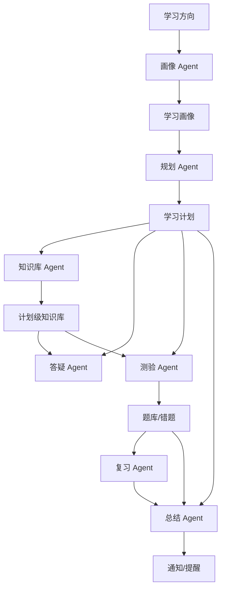

# Agent 设计

## Agent 列表

| Agent | 目标 | 输入 | 输出 |
| --- | --- | --- | --- |
| 画像 Agent | 理解用户基础、目标、时间和偏好 | 学习方向、补充说明、对话回答 | 学习画像 |
| 规划 Agent | 生成阶段学习路径和任务 | 学习画像、方向、目标周期 | 阶段、任务、节奏 |
| 知识库 Agent | 管理资料解析和索引 | 文档、计划上下文 | 摘要、切片、索引 |
| 答疑 Agent | 基于计划知识库个性化讲解 | 计划、画像、检索片段、问题 | 回答、引用、追问 |
| 测验 Agent | 生成练习题并归档 | 计划、阶段、资料、题型要求 | 题目、答案、解析 |
| 复习 Agent | 组织薄弱项复习 | 学习记录、错题、问答 | 今日复习建议 |
| 总结 Agent | 输出学习反馈 | 任务、资料、问答、测验、复习 | 日报/周报 |

## 冷启动与增强模式

Agent 必须支持两种运行模式：

| 模式 | 触发条件 | Agent 行为 | 输出要求 |
| --- | --- | --- | --- |
| 无知识库模式 | 当前计划无资料、资料解析中/失败、检索为空 | 基于学习方向、画像、计划阶段和通用知识工作 | 明确标记未引用计划资料，仍可回答、出题、总结 |
| 知识库增强模式 | 当前计划有解析成功资料且召回相关片段 | 优先基于计划资料工作 | 输出引用来源、相关知识点和资料边界 |

禁止将“上传资料”作为问答、测验、建议、总结等核心 AI 能力的强制前置条件。知识库只能增强质量和个性化程度。

## 编排原则

- 上游 Agent 输出必须结构化，作为下游输入。
- Agent 输入由业务层组装，不允许 Agent 自行跨计划拉取数据。
- 输出必须经过 JSON Schema 或 DTO 校验。
- 失败结果要落入 `agent_tasks`，支持重试。
- Prompt 模板应版本化，方便回滚和 A/B 测试。
- Prompt 必须包含当前运行模式，要求模型在无知识库模式下使用通用知识，在增强模式下优先引用计划资料。

## 完整编排流



## 结构化输出示例

### 学习画像

```json
{
  "goal": "4 个月内掌握 Java 后端基础并完成项目作品",
  "currentLevel": "BEGINNER",
  "timeBudget": "每周 8 小时",
  "preferences": ["项目驱动", "示例讲解"],
  "risks": ["基础薄弱", "时间碎片化"],
  "strategy": "先补齐 Java 基础，再进入 Spring Boot 和项目实践"
}
```

### 测验题目

```json
{
  "questions": [
    {
      "type": "SINGLE_CHOICE",
      "difficulty": "MEDIUM",
      "stem": "Spring MVC 中 Controller 的主要职责是什么？",
      "options": [
        {"key": "A", "text": "处理 HTTP 请求并协调业务调用"},
        {"key": "B", "text": "直接管理数据库连接"}
      ],
      "standardAnswer": ["A"],
      "explanation": "Controller 负责接收请求、参数校验和调用业务服务，不应承载核心业务逻辑。",
      "knowledgePoints": ["Spring MVC", "分层架构"],
      "citations": []
    }
  ]
}
```

## Prompt 模板管理

建议目录：

```text
src/main/resources/prompts/
  profile-agent-v1.md
  planner-agent-v1.md
  tutor-agent-v1.md
  quiz-agent-v1.md
  review-agent-v1.md
  summary-agent-v1.md
```

模板变量建议：

- `user_profile`
- `learning_direction`
- `learning_plan`
- `current_stage`
- `retrieved_chunks`
- `question_constraints`
- `output_schema`

## 模型分配建议

| 场景 | 能力重点 |
| --- | --- |
| 画像/规划 | 推理、结构化总结 |
| 答疑 | 引用准确性、讲解能力 |
| 测验 | 结构化输出、题目质量 |
| 复习/总结 | 归纳、优先级判断 |
