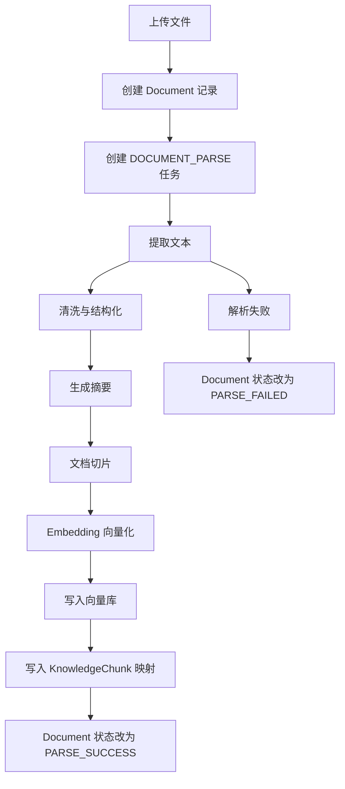

# RAG 与文档处理流水线

## 支持文件

完整 Web 版本支持：

- PDF
- PPT/PPTX
- Markdown
- TXT
- DOCX
- 网页链接

预留扩展：

- 图片 OCR
- 视频字幕

## 文档处理流程

## 切片策略

- 按章节、页码、标题优先切片。
- 无结构文本按 token 长度切片。
- 每个 chunk 保留来源信息：文件 ID、页码/章节、chunk 序号。
- chunk 内容不能跨计划混合。

## 检索策略

1. 根据 `plan_id` 限制检索范围。
2. 对用户问题生成 query embedding。
3. 在向量库中召回 Top K。
4. 根据相似度、来源新鲜度和阶段相关性重排。
5. 将检索片段传给答疑 Agent 或测验 Agent。
6. 输出引用来源。

## 无知识库冷启动策略

RAG 是增强层，不是 AI 功能启用条件。

- 当前计划无资料：跳过检索，进入无知识库模式。
- 资料仍在解析中：提示资料尚未用于增强，但允许通用问答和通用出题。
- 检索为空：输出通用回答或通用题目，并明确“未引用计划资料”。
- 向量库不可用：可使用关键词检索；关键词也为空时进入无知识库模式。
- 无知识库模式下产生的问答、题目、报告仍必须写入当前 `plan_id`，不得写入全局空间。

## 删除同步

删除文档时必须执行：

1. 逻辑删除 `documents`。
2. 删除或标记失效 `knowledge_chunks`。
3. 删除向量库中的对应 `vector_id`。
4. 保留历史问答和题目中的引用快照，避免历史记录不可读。

## 任务状态

| 阶段 | Document 状态 | Task 状态 |
| --- | --- | --- |
| 文件传输中 | `UPLOADING` | `PENDING` |
| 文本解析 | `PARSING` | `RUNNING` |
| 摘要/切片/向量化 | `PARSING` | `RUNNING` |
| 全部完成 | `PARSE_SUCCESS` | `SUCCESS` |
| 任一关键步骤失败 | `PARSE_FAILED` | `FAILED` |

## 降级策略

- 文档解析失败：允许重试，不进入 RAG。
- 向量库不可用：可短期退化为关键词检索，但需要在回答中标记引用质量降低。
- 无检索结果：答疑 Agent 可以基于通用知识回答，但必须说明未找到计划资料引用。
- 无资料生成测验：测验 Agent 必须生成通用练习题，并将 `source_scope` 标记为 `COLD_START`。
