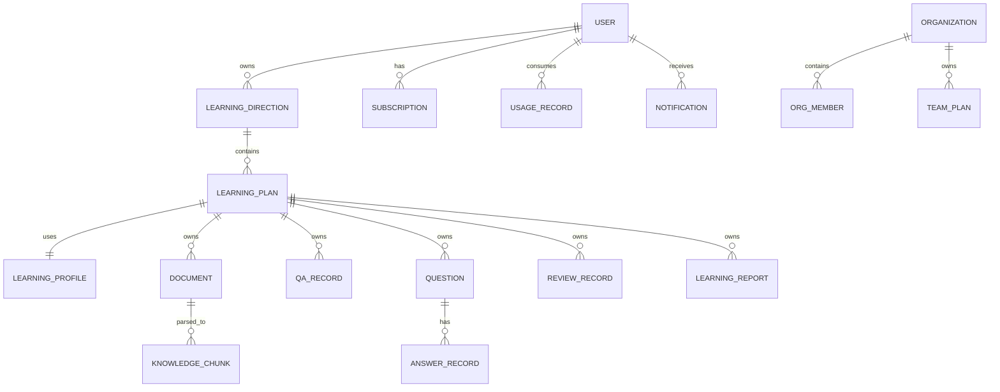

# 领域模型

## 聚合关系

## 核心实体

| 实体 | 说明 | 关键字段 |
| --- | --- | --- |
| User | 普通学习用户 | id, nickname, account, created_at |
| LearningDirection | 用户想学习的技能方向 | id, user_id, name, category, description |
| LearningPlan | 具体学习执行单元 | id, direction_id, profile_id, status, stages |
| LearningProfile | 结构化学习画像 | id, goal, current_level, time_budget, preference, risks |
| Document | 计划级资料元数据 | id, plan_id, name, type, parse_status, summary |
| KnowledgeChunk | 文档切片与引用映射 | id, plan_id, document_id, content, chunk_index, vector_id |
| QARecord | 计划内问答记录 | id, plan_id, question, answer, citations |
| Question | 题库题目 | id, plan_id, type, difficulty, stem, answer, explanation |
| AnswerRecord | 用户作答记录 | id, question_id, user_id, user_answer, is_correct |
| ReviewRecord | 复习记录 | id, plan_id, knowledge_point, priority, due_at, completed_at |
| LearningReport | 学习报告 | id, plan_id, period_type, summary, weak_points, next_actions |
| Subscription | 订阅 | id, user_id, plan_code, status, started_at, expired_at |
| UsageRecord | 用量记录 | id, user_id, usage_type, amount, related_task_id |
| Notification | 通知提醒 | id, user_id, type, title, content, read_at |
| Organization | 企业/团队组织 | id, name, owner_user_id, status |
| OrgMember | 组织成员 | id, organization_id, user_id, role |

## 状态枚举

### LearningPlanStatus

- `DRAFT`
- `ACTIVE`
- `PAUSED`
- `COMPLETED`
- `ARCHIVED`

### DocumentParseStatus

- `UPLOADING`
- `PARSING`
- `PARSE_SUCCESS`
- `PARSE_FAILED`

### QuestionType

- `SINGLE_CHOICE`
- `MULTIPLE_CHOICE`
- `TRUE_FALSE`
- `SHORT_ANSWER`

### AgentTaskStatus

- `PENDING`
- `RUNNING`
- `SUCCESS`
- `FAILED`
- `CANCELED`

### SubscriptionStatus

- `FREE`
- `TRIAL`
- `ACTIVE`
- `PAST_DUE`
- `CANCELED`

## 强规则

- `Document`、`KnowledgeChunk`、`QARecord`、`Question`、`ReviewRecord`、`LearningReport` 必须具备 `plan_id`。
- 查询计划级数据时必须同时校验当前用户对该计划的访问权限。
- 不允许通过全局知识库直接生成问答、题目或复习建议。
- 题目追加生成不能覆盖旧题。
