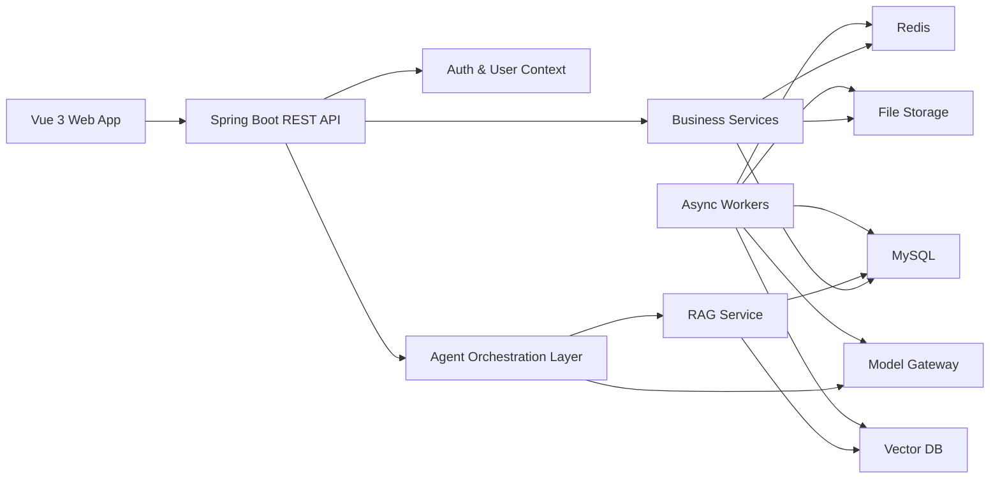

# 系统架构

## 总体架构

## 分层说明

| 层级 | 职责 |
| --- | --- |
| 表现层 | Vue 页面、路由、状态管理、表单、加载状态、错误提示 |
| 接口层 | REST API、鉴权、参数校验、统一响应、异常处理 |
| 业务层 | 学习方向、计划、画像、知识库、问答、测验、复习、报告服务 |
| Agent 协调层 | Agent 角色分发、Prompt 模板、上下文组装、结构化输出校验 |
| AI 模型层 | 统一模型调用，屏蔽供应商差异 |
| RAG 层 | 文档切片、向量化、检索、引用来源追踪 |
| 数据层 | MySQL 主数据、Redis 状态缓存、向量库语义索引、文件存储 |

## 完整版本部署形态

- 前端独立部署为静态资源或 CDN。
- 后端可从模块化单体起步，但服务边界按可拆分方式设计。
- 异步任务独立为 worker 模块，承担文档解析、摘要、向量化、Agent 长任务和报告生成。
- MySQL 存储主业务数据。
- Redis 存储任务状态、会话短期上下文和限流数据。
- 向量库通过接口抽象，生产优先选择 Milvus；团队希望简化部署时可选 pgvector。
- 增加管理后台、订阅额度、埋点分析和通知服务的模块边界。

## 关键边界

- 所有计划级能力必须传入并校验 `plan_id`。
- Agent 不直接访问数据库，由业务服务准备上下文并持久化结果。
- 模型供应商不出现在业务模块中，只能通过模型网关调用。
- 文档删除时必须同步删除文件元数据、向量索引和相关引用映射。

## 演进方向

- 单体服务拆分为 API 服务、Agent 服务、文档处理 worker。
- Agent 编排从自定义服务升级为 LangGraph4j 或状态图框架。
- 增加企业组织、团队空间、多租户计费和额度控制。
