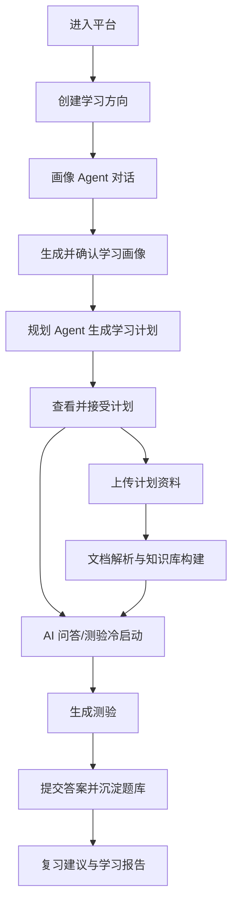

# 用户流程

## 主流程

## 首次使用流程

1. 用户进入工作台。
2. 点击创建学习方向。
3. 填写方向名称、分类、补充说明。
4. 进入画像 Agent 对话。
5. 回答目标、基础、投入时间、周期、偏好、困难。
6. 查看结构化学习画像。
7. 确认画像并生成学习计划。
8. 进入计划详情页开始学习，可立即使用通用问答和通用测验。
9. 后续上传资料后，问答、测验、复习自动升级为知识库增强模式。

## 无知识库冷启动流程

1. 用户创建方向并生成计划。
2. 用户未上传资料，或资料尚未解析成功。
3. 用户进入问答页提问。
4. 答疑 Agent 使用学习方向、计划目标、画像信息和通用知识回答。
5. 回答明确标识“未引用计划资料”。
6. 用户进入测验页生成题目。
7. 测验 Agent 基于学习方向和计划阶段生成通用练习题。
8. 题目仍保存到当前计划题库，后续可作答、统计、复习。
9. 用户上传资料并解析成功后，系统进入知识库增强模式。

## 知识库与答疑流程

1. 用户在计划详情中进入知识库。
2. 上传 PDF、PPT、Markdown 或 TXT。
3. 后端创建文档记录和异步解析任务。
4. 前端展示上传中、解析中、成功或失败状态。
5. 解析成功后展示摘要。
6. 用户进入问答页提问。
7. 答疑 Agent 基于当前 `plan_id` 检索知识片段。
8. 如果有相关片段，回答展示讲解内容、引用来源、相关知识点和推荐追问。
9. 如果无资料或无召回结果，答疑 Agent 使用通用知识回答，并标识未引用计划资料。

## 测验流程

1. 用户进入测验页。
2. 选择难度、题量、题型和范围。
3. 测验 Agent 生成题目。
4. 系统将题目保存到计划题库。
5. 用户作答并提交。
6. 系统保存作答记录，标记正确/错误。
7. 错题进入错题集合，并影响复习建议。

## 异常流程

| 场景 | 前端表现 | 后端处理 |
| --- | --- | --- |
| 画像生成失败 | 显示失败原因和重试按钮 | 记录 Agent 调用错误和上下文 |
| 文档解析失败 | 文档状态为解析失败，允许重试 | 保留原始文件和失败原因 |
| 知识库无资料 | 问答提示可先上传资料，也可使用通用解释 | 不执行 RAG 或降级回答 |
| 无资料生成测验 | 显示通用练习题，标记为冷启动题 | 基于学习方向/计划生成，不依赖 RAG |
| 测验生成超时 | 显示任务仍在处理中 | 支持异步查询任务状态 |
| 引用来源缺失 | 明确标记未引用计划资料 | 记录召回为空原因 |
